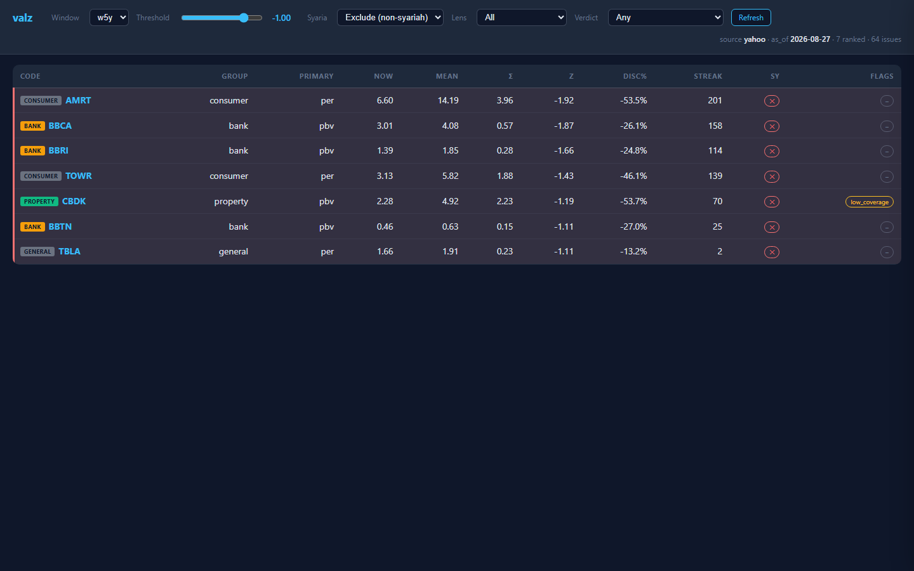
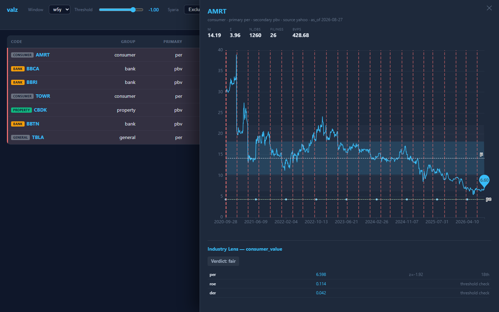

# valz — Valuation Z-Score Screener

> *Screener IHSG yang ngitung berapa standar-deviasi diskon suatu
> ticker terhadap histori valuasinya sendiri, plus sector-aware
> lens biar "murah" nya gak ketuker dengan "murah" di sektor yang
> salah.*



## Apa ini?

Cheap-vs-its-own-history itu mean-reversion signal yang **butuh konteks per saham**: PER 9 di BBCA artinya beda dengan PER 9 di BUMI. valz fit rolling stats (3y / 5y windows, winsorized 1%/99%) per ticker pada multiple primer sektornya — **bank → P/B**, **commodity → EV/EBITDA** (fallback P/B kalo data sparse), **consumer/telco → P/E** — terus rank diskonnya dalam z-score.

Screening sederhana nge-filter "z < -1.5". Tapi tanpa konteks sektor, hasilnya noisy — bank dengan P/B 1.3 normal, tapi coal company dengan P/B 1.3 biasanya tanda masalah. **Industry lens** (v0.6.0) menambahkan per-sector primary + supporting thresholds + verdict rule supaya output comparable antar sektor.

## Quick start (Windows local — buat trader/investor)

> **5 menit dari download ke running.** Zero install, zero Python, zero command line.

```
1. Download release terbaru dari
   https://github.com/lokino23/valz/releases
   (cari file valz-X.Y.Z-portable.zip, sekitar 22 MB)

2. Extract zip ke folder mana aja, misal C:\valz\
   (hasilnya: C:\valz\valz\valz.exe + C:\valz\valz\_internal\)

3. Double-click C:\valz\valz\valz.exe

4. Browser otomatis kebuka ke http://127.0.0.1:8103

5. Browse. Klik ticker mana aja buat lihat drawer.
```

## Requirements

| | Minimum | Recommended |
|---|---|---|
| **OS** | Windows 10 (64-bit) | Windows 11 (64-bit) |
| **Python** | ❌ GAK PERLU — udah di-embed di `valz.exe` | — |
| **RAM** | 200 MB (valz + browser tab) | 500 MB |
| **Disk** | 100 MB (extracted zip) | 200 MB (kalau data perlu refresh) |
| **CPU** | 2 GHz dual core | Modern x64 |
| **Screen** | 1366×768 (chart drawer butuh ruang) | 1920×1080+ |
| **Network** | Gak wajib — bundled data cukup | Internet utk klik "Refresh" |

**Yang lo GAK perlu install:**

- ❌ Python 3.x
- ❌ pip / virtualenv
- ❌ PATH / environment variables
- ❌ Admin rights (kecuali extract ke `C:\Program Files\`)
- ❌ Command line
- ❌ Database server

**Yang di-bundle di zip (semua self-contained, 22 MB total):**

| Komponen | Size | Isi |
|---|---|---|
| `valz.exe` | 5.4 MB | PyInstaller-bundled executable: Python 3.11 runtime + stdlib + FastAPI + uvicorn + pyyaml |
| `_internal/` | ~14 MB | Compiled .pyd modules (Windows native) + Python DLLs |
| `payload/valz.db` | 32 MB | SQLite database: 113 IHSG ticker × 6 tahun daily history |
| `payload/config.yaml` | 4 KB | sector_map + 6 industry_lenses + peer_groups |

## Tampilan

### Screener — lihat z-score semua ticker sekaligus


Kolom yang penting: **Σ (sigma)**, **Z (z-score)**, **DISC%** (discount ke mean), **STREAK** (hari berturut di bawah threshold). Badge di kiri: sektor + verdict (bila industry_lens aktif).

**Filter yang sering dipake:**

- `Max z: -1.0` → ticker dengan z-score di bawah -1 (default: semua ticker di diskon 1σ)
- `Syaria: only` → cuma ticker yang lolos DES
- `Lens: bank` → cuma emiten bank (filter dari 6 industry_lenses)
- `Verdict: undervalued_quality` → cuma yang trigger rule "cheap + good quality"

### Drawer — klik ticker, lihat history + lens



Klik mana aja di screener row → drawer kebuka di kanan. Atas: ticker + price chart 5 tahun dengan μ/σ bands. Bawah: **Industry Lens** verdict (untuk AMRT di atas: verdict `fair`, primary `per`, supporting metrics ROE & DER dicek vs threshold).

Stats teratas (μ, Σ, N_OBS, FILINGS, BVPS) di-derive dari data real-time; klik "Refresh" di header buat update.

## Customize (advanced, optional)

Edit `%LOCALAPPDATA%\valz\data\config.yaml` untuk adjust:

```yaml
sector_map:        # ticker → sector mapping (default: 113 ticker)
  BBCA: bank
  ICBP: consumer
  TLKM: telco
  # tambah ticker lo di sini

peer_groups:       # peer set untuk AMRT-like false positive detection
  retail: [AMRT, ACES, MAPI]
  # ...

industry_lenses:  # per-sector verdict rules
  bank:
    primary: pbv
    supporting: { roe_min: 0.15, der_max: 5.0 }
    # ...
```

**Restart `valz.exe`** setiap kali edit config biar kebaca ulang.

## Refresh data (optional)

Klik tombol **Refresh** di header (sebelah dropdown Verdict). Tombol ini:
- Re-fetch prices dari Yahoo Finance (primary) + arjum (fallback)
- Re-fetch fundamentals dari idx-mcp (kalau `IDX_MCP_URL` di-set)
- Recompute multiples + z-scores
- Update local SQLite database

**Default behavior:** auto-refresh on launch kalo data > 1 hari old. Tombol buat **manual override** — kalo lo mau data IHSG close jam 16:00 langsung liat tanpa restart exe.

**Buat setup refresh ke homeserver** (advanced):

1. Create `C:\Users\HYPE AMD\AppData\Local\valz\.env`:
   ```
   IDX_MCP_URL=http://100.86.244.90:8001/mcp
   ARJUM_API_KEY=sk_live_xxxxx
   ```
2. Restart `valz.exe`
3. Klik Refresh — bakal pull dari homeserver

`ARJUM_API_KEY` optional — kalo kosong, pake Yahoo only (cukup buat 95%+ ticker).

## Troubleshooting

| Gejala | Solusi |
|---|---|
| Browser gak kebuka otomatis | Manual buka `http://127.0.0.1:8103` |
| "Port already in use" | Tutup `valz.exe` lain, atau set `VALZ_PORT_BASE` env var |
| Stuck loading forever | Cek `%LOCALAPPDATA%\valz\valz.log` |
| Data > 1 minggu | Download zip baru dari Releases, atau klik Refresh |
| Ticker gak muncul di screener | Bisa jadi coverage issue — cek di `Issues` column |
| Refresh error "IDX_MCP_URL not configured" | Create `.env` file (lihat section di atas) |

## Maintainer / cloud setup (untuk developer)

```bash
# 1) clone + config
git clone ssh://git@100.86.244.90:2222/gitadmin/valz.git ~/valz/src
cd ~/valz/src && cp config.example.yaml config.yaml

# 2) seed universe (idx-mcp must be reachable — always export the LAN
#    address, NEVER localhost which gets REFUSED on this host)
export IDX_MCP_URL=http://100.86.244.90:8001/mcp
python3 backfill.py --seed            # writes universe into config.yaml

# 3) backfill history (first run ~30-60 min for 113 codes)
python3 backfill.py

# 4) compute multiples + z-stats
python3 compute.py

# 5) serve
echo 'IDX_MCP_URL=http://100.86.244.90:8001/mcp' > .env
docker compose up -d --build          # UI at http://<host>:8102

# 6) nightly refresh (weekdays 19:05) — refresh.sh sources .env itself
crontab -e
#   5 19 * * 1-5 cd ~/valz/src && ./refresh.sh >> data/refresh.log 2>&1
```

## Data provenance

- **Prices**: Yahoo Finance `.JK` primary (~6 tahun daily); arjum fallback.
  Per-row `source` field di API + `mixed` flag kalo rows disagree on origin.
- **Fundamentals**: idx-mcp `idx_fundamentals` XBRL-audited filings,
  cached permanently di SQLite (`raw_json` kept verbatim). Filing
  considered available 90 hari setelah period end.
- **Shares**: implied from filings (`equity ÷ BVPS`) sebagai continuous
  series, anchored oleh `idx_shares` listed-share counts where fetched;
  corporate actions dikoreksi via `ca_overrides` di config.

## Methodology in one breath

TTM multiples dibangun harian dari trailing four-quarter filings (EBITDA
all-or-nothing); `z = (value_now − μ) / σ` over the window dengan
1%/99% winsorization; non-positive denominators di-exclude; streak counts
hari berturut di bawah watch threshold; ROE / rev-growth / DER adalah
display-only context (gak pernah di-rank).

## ca_overrides

Rights issues / stock splits bikin implied shares jump. Add entry:

```yaml
ca_overrides:
  - {code: BBRI, date: "2024-06-10", mult: 0.83}
```

`mult` scales shares *sebelum* tanggal tersebut (dilution factor).
Verify dengan ngecek PBV series sekitar ex-date buat sawtooth — kalo
ada, override missing atau salah.

## API (read-only)

- `GET /api/screen?window=w5y&max_z=-1.0&lens=bank&verdict=undervalued_quality&syaria=all`
- `GET /api/ticker/BBCA?window=w5y`
- `GET /api/valuation/BBCA?window=w5y`
- `GET /api/refresh` (POST) — trigger refresh
- `GET /api/refresh/status` — poll status
- `GET /api/meta` — version + universe_count + last_compute

Validation errors return 422 sebelum touch database; unknown tickers
return 404.

## Lisensi

MIT (lihat `LICENSE`).

## Credits

Built oleh [Mavis](https://github.com/lokino23) — pair-programming session dengan
AI agent MiniMax-M3. Data sources: Yahoo Finance, idx-mcp (XBRL), arjum.
